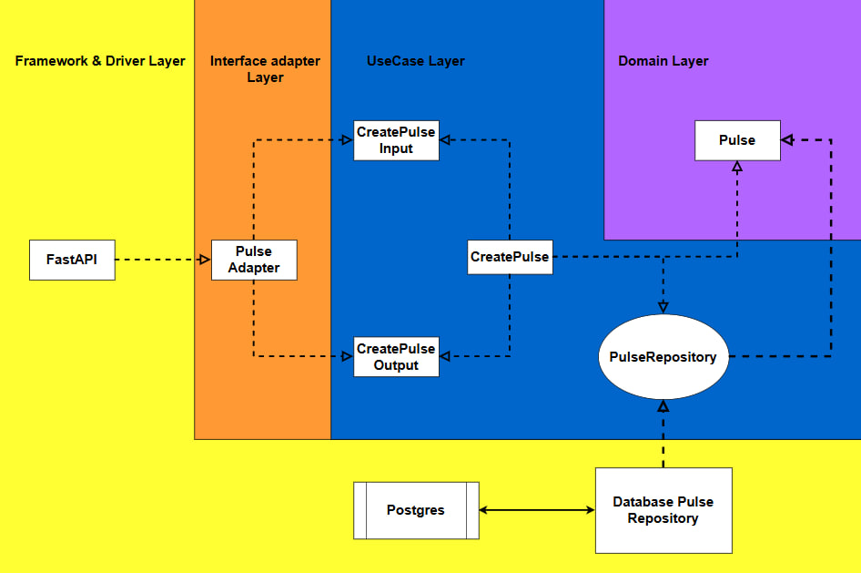
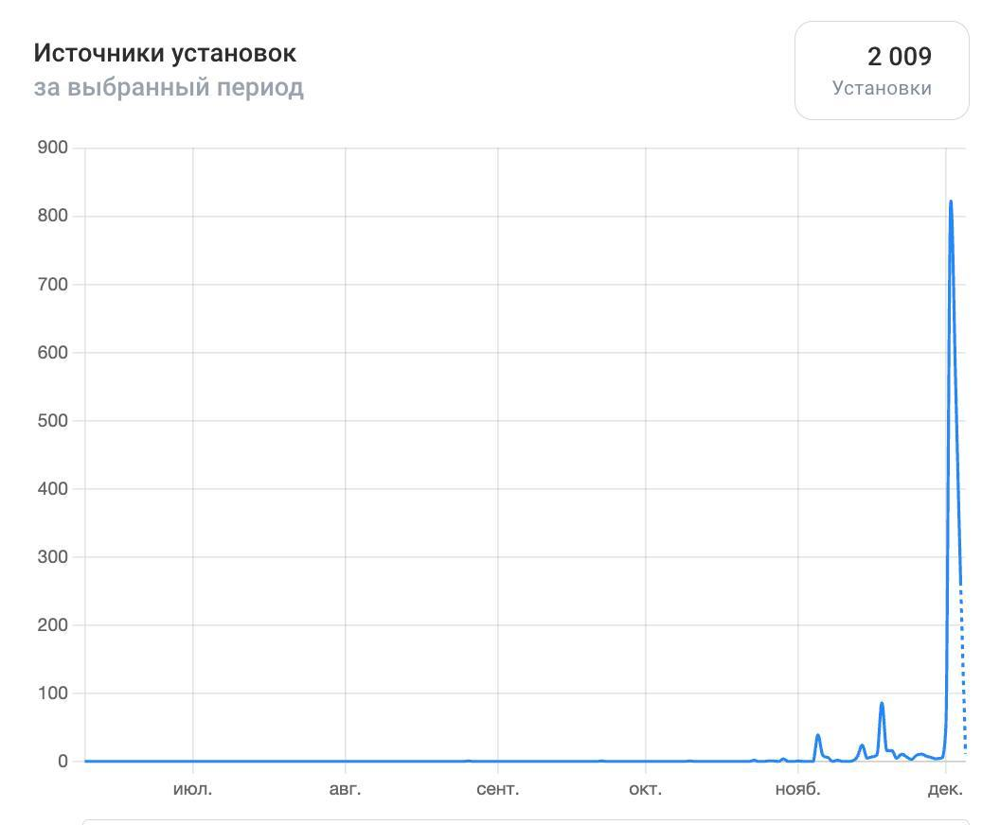

# Сервис Vmeste

Проект состоит из нескольких репозиториев:
```
Vmeste
├── auth-service                                             # сервис авторизации
├── content-service                                          # сервис контента
├── vk-client                                                # frontend часть vk-клиента
├── admin-frontend                                           # frontend часть админки
├── protobuf                                                 # контранкы gRPC
├── inappropriate-content-detector-model                     # модель для модерации
├── nginx                                                    # конфиги nginx

```

Приложение состоит из двух микросервисов auth-service и content-service соответственно.
В каждом из микросервисов реализована чистая архитектура.

Content-service написан на python, поэтому интерфейсы реализованы через ABC (Abstract Base Classes)

## Структура content-service:
```
content-service/
├── migrations/
├── services/
│ ├── api/                      # API слой приложения
│ │ ├── routers/                    # Роутеры FastAPI
│ │ └── schemas/                    # Cхемы для роутеров FastAPI
│ ├── data/                     # Работа с данными
│ │ ├── external/                 # Интеграция с VK API
│ │ ├── models/                   # Модели данных для БД
│ │ └── repositories/             # Паттерн Repository для доступа к данным
│ └── gRPC/                     # Конфигурации gRPC
└── src/
│ ├── adapters/                 # Адаптеры для внешних систем (общаются посредством dto)
│ ├── domain/                   # Доменный слой и бизнес-логика
│ │ ├── dto/                      # Data Transfer Objects (DTO)
│ │ ├── entities/                 # Сущности предметной области (как этого требует clean architecture)
│ │ ├── interfaces/               # Интерфейсы через ABC
│ │ └── use_cases/                # Сценарии использования (слой Use Case-ов)
```

В рамках чистой и луковой архитектуры разрешено обращаться "через слой", не злоупотребляя этим, главное принцип зависимостей и он здесь везде выполняется.
Поэтому роутеры FastAPI могут свободно обращаться, например к сущностям (entities), если это понадобится. Но, при этом, конечно же из Domain Layer в слой Usecase-ов и выше нельзя, так как тогда нарушится принцип внедрения зависимостей (Dependency Injection).

Схематично это можно представить так:



На схеме представлена функциональность создания Импульса (проекта). Для остальных сущностей (Application, Complaint, Feed, Admin, Notification, Image, Tag) она работает аналогично. Каждая сущность имеет свой собственный набор функций. Например, для Импульсов, помимо создания, реализованы возможности обновления содержимого, удаления, поиска проекта по ID, а также получения списка всех проектов пользователя.


Для проекта проводилось также нагрузочное тестирование посредством Locust.
Приложение успешно справлялось с нагрузкой 100 RPS.
[Ознакомиться с отчетом тестирования можно открыв этот файл](pictures/load_test.html)
[Ознакомиться с презентацией проекта можно здесь](pictures/VKFC'24_Vmeste_.pptx)

В какой-то момент количество зарегистрированных пользователей достигло двух тысяч:

